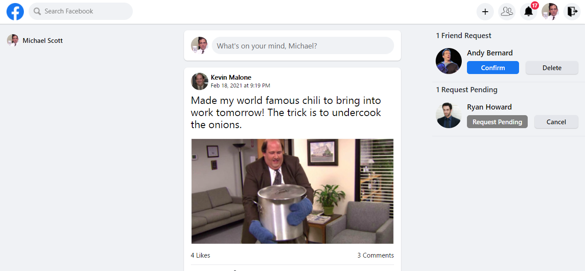
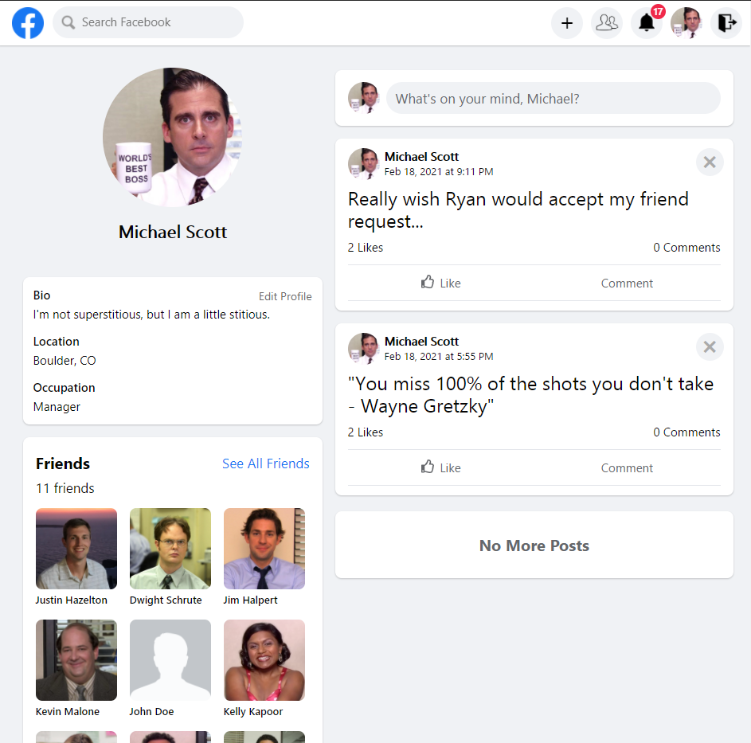
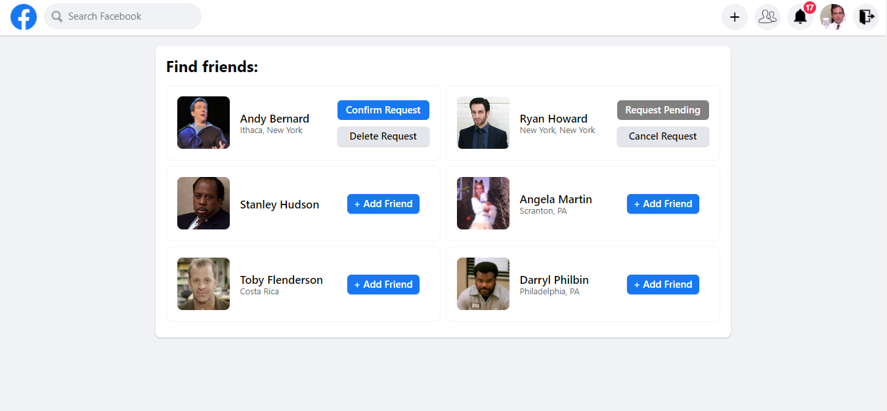
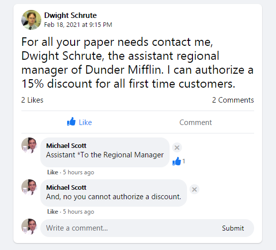
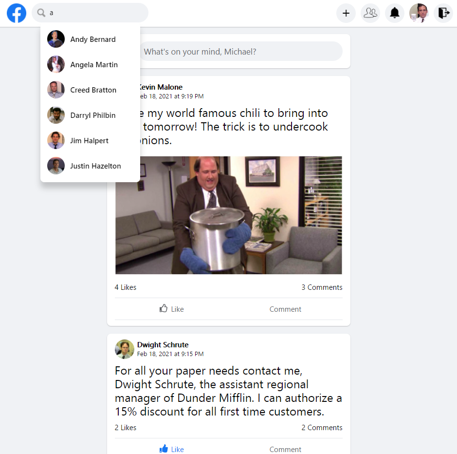
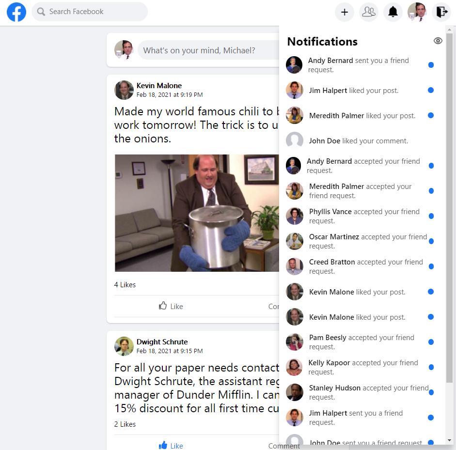
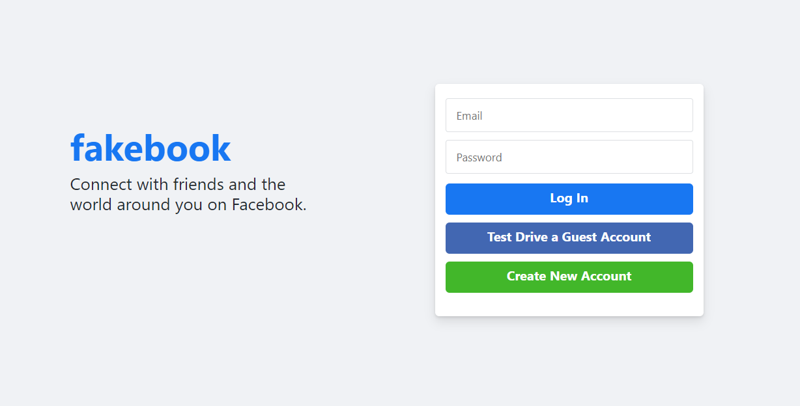

# Fakebook

Facebook Clone

Full stack MERN Application, deployed on Heroku.

🔗 **Live preview** of the app is [here](https://justins-fakebook.herokuapp.com/).

### This App mimics many of Facebook's main features:
* Create, read, update, and delete your user and user profile.
* Create, read, and delete posts, comments, and images
* Connect with other users 
  * Easily send outgoing Friend Requests and accepting incoming Friend Requests
  * Easily unfriend users
  * Comment on other's posts or images
  * Like other's posts, images, or comments
  * Easily find other users to become friends with using the Searchbar or Find Friends page
* Customize your profile
  * Upload a profile picture
  * Customize your bio, location, and occupaiton
* Real time notification menu notify's you when someone has interacted with you
* RESTful API is versatile and accessible by any frontend.
* User Authenticaiton:
  * Sign up as a new user
    * bcryptjs: Hashes passwords in order to safely secure user data
  * Log in in order to create posts and comments
    * jsonwebtoken - creates token for API to verify on each call

# Built With:

- JavaScript
- ReactJS
- NodeJS
- ExpressJS
- MongoDB 
- Mongoose
- Amazon Web Services
- Axios
- Multer image puploading
- HTML/CSS
- Heroku Hosting

## Pictures:

### Main Page:

### Profile Page:

### Easily Manage Incoming and Sent Requests:

### Interact with Posts and Comments:

### Use the Searchbar to find Friends and Users:
  

### Real time notifications:

### Login Page:

This App was created to show off my skills as a web developer. Not intended to infringe Facebook's copyright or to compete with Facebook in any way.
